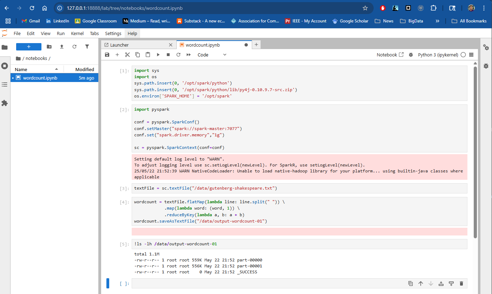

# CSC467 Cluster

A template to support development of containerization learning materials

## Notes:

### Warning

- If you clone into a Windows environment, makes sure that your git is set to keep `LF`:

~~~
git config --global core.autocrlf false
git clone https://github.com/class-master/csc467env
~~~

### Building the images

- You should build the images in the following order:

~~~
docker compose build --no-cache base
~~~

- If you are an instructor with lecture nodes and grading, build `master-instructor`:

~~~
docker compose build --no-cache master-instructor
~~~

- Otherwise, build `master-student`:

~~~
docker compose build --no-cache master-student
~~~

### Launching the cluster

- You should launch in the following order:
    - You can launch `master-instructor` or `master-student` depending on your requirements. 
    - You can adjust the number of workers from 4 to a number suitable to your platform. 
    - Specific hardware configuration for the workers (memory, CPUs) can be adjusted inside `docker-compose.yml`.
~~~
docker compose up -d master-instructor # or master-student
docker compose up -d worker --scale worker=4
~~~

### Test

- Access the Jupyter server via http://127.0.0.1:18888/
   
- Go to the `notebooks` directory, open the `wordcount.ipynb` and run the entire notebook. You should see the following outcome:

### Build mkdocs server (for instructor)

`mkdocs serve --dev-addr=0.0.0.0:8000` to support external view of mkdocs
